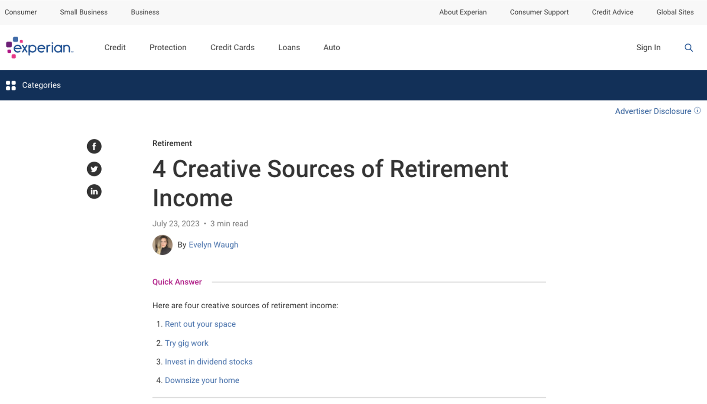

# Experian Bot 

1. [The Bot](#bot) 
2. [Chat](#chat)
3. [Develop](#develop) 
4. [Deploy](#deploy)
5. [Knowledge Retrieval](#example)

## The Bot 
This chatbot integrates:

- Webcrawl from Experian's public pages (July 25, 2023).
- Document retrieval from a PostgreSQL pgvector store on AWS Aurora.
- OpenAI API and LangChain.
- A Gradio user interface hosted on Huggingface Space.

## Chat 

[**Chat with Experian Bot**](https://larryyin-experian-bot.hf.space)

## Develop 
[End-to-end Development](./develop)

## Deploy 
[Deployment on EC2](./deploy)

## Knowledge Retrieval 

[Return to Top](#pagetop)
